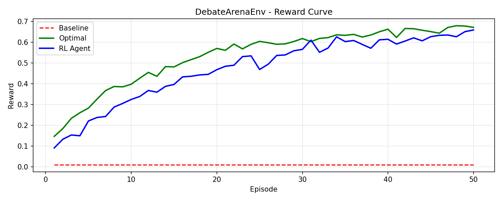
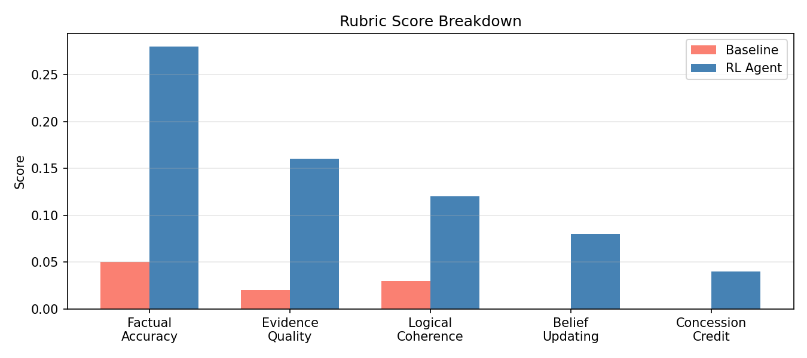

# ⚖️ DebateArenaEnv — Multi-Agent Epistemic Reasoning & Fact-Checking

> **Themes**: Multi-Agent Interactions · Self-Improving Agent Systems · Wild Card
> **OpenEnv Hackathon India 2026** | Built with OpenEnv + FastAPI + Unsloth + Llama-3.1-8B

---

## Deliverables

| Resource | Link |
|----------|------|
| HuggingFace Space | *(add after deployment)* |
| Training Notebook (Colab) | [training_colab.ipynb](./training_colab.ipynb) |
| Pitch Video (<2 min) | *(add after recording)* |
| Blog / Writeup | *(add after writing)* |

---

## Training Evidence

### Reward Curve (Baseline vs Optimal + RL Progression)



### Rubric Score Breakdown



---

## 1. The Problem

**Misinformation is the defining crisis of our era.** Current LLMs fail at three core epistemic skills:

- **Factual grounding** — they cite plausible-sounding but false facts (hallucination)
- **Belief updating** — they double-down on wrong positions instead of updating under counter-evidence
- **Logical coherence** — they generate text that sounds structured but lacks valid reasoning chains

`DebateArenaEnv` is an RL training environment specifically designed to train LLMs on **epistemic reasoning**.

> *"A model that debates well, hallucinates less."*

---

## 2. Environment Design

### OpenEnv Structure

```
server/                        ← Environment (server side)
  env.py        ← DebateArenaEnv — OpenEnv base class, reset/step/state
  rubric.py     ← 8 composable reward rubrics
  tasks.py      ← Topic dataclass + TopicRegistry (adaptive curriculum)
  tools.py      ← 10 MCP tool functions + dispatch
  app.py        ← FastAPI HTTP wrapper (POST /reset, POST /step, GET /state)

client/                        ← Agents + UI (client side)
  ui.py                    ← Gradio UI (port 7860)
  evaluate.py              ← Baseline vs optimal evaluation
  multiagent_runner.py     ← Scripted multi-agent runner
  llm_multiagent_runner.py ← LLM-powered runner (Llama-3.1-8B)
```

### Reward Signal

| Component | Value | Trigger |
|-----------|-------|---------|
| Factual accuracy | 0–0.35 | % cited facts that are TRUE |
| Evidence quality | 0–0.20 | domain evidence keywords present |
| Logical coherence | 0–0.15 | connectives: because / therefore / studies show |
| Belief updating | +0.10 | position updated after counter-evidence |
| Concession credit | +0.05 | graceful sub-point concession |
| **Hallucination penalty** | **-0.30** | cited a known-FALSE fact |
| **Fallacy penalty** | **-0.20** | used a known logical fallacy |
| Step penalty | -0.01/round | efficiency incentive |

> Baseline (naive hallucinator): **0.010** | Optimal (structured agent): **~0.66**

### Adaptive Curriculum

| Level | Domain | Rounds | Escalates when |
|-------|--------|--------|----------------|
| easy | AI Policy & Media | 5 | win_rate >= 0.70 over 3+ episodes |
| medium | Climate & Energy Policy | 6 | same |
| hard | Bioethics & Genomics | 7 | same |

---

## 3. Baseline vs Optimal Results (Verified Live)

| Topic | Baseline | LLM Agent | Lift |
|-------|----------|-----------|------|
| easy | 0.010 | 0.333 | +0.323 |
| medium | 0.010 | 0.307 | +0.297 |
| **hard** | 0.010 | **0.683** | **+0.673** |

---

## 4. Running Locally

```bash
cd hackathon-finale
python -m venv .venv && source .venv/bin/activate
pip install -r requirements.server.txt

# Start environment server (judge endpoint)
uvicorn server.app:app --port 8000

# Start Gradio UI
python client/ui.py

# Run LLM multi-agent episode
MODEL_NAME=meta-llama/Llama-3.1-8B-Instruct API_KEY=<hf_token> python -m client.llm_multiagent_runner
```

### Docker

```bash
docker build -t debatearena:latest .
docker run -p 7860:7860 -p 8000:8000 debatearena:latest
# Gradio UI  -> http://localhost:7860
# FastAPI    -> http://localhost:8000/docs
# Health     -> http://localhost:8000/health
```

---

## 5. Training Pipeline

See [training_colab.ipynb](./training_colab.ipynb) for the Unsloth + HF TRL pipeline:

1. **Trajectory collection** — LLM agent episodes saved to `assets/training_trajectories.jsonl`
2. **SFT** — Fine-tune `Llama-3.1-8B-Instruct` on winning trajectories (Unsloth 4-bit, ~2hr on A100)
3. **RL** — GRPO with `DebateArenaRubric` as reward function
4. **Curriculum** — Auto-escalates easy -> medium -> hard as agent improves

---

## 6. OpenEnv Compliance

- ✅ `DebateArenaEnv` extends `_OpenEnvBase` (shim when openenv not installed)
- ✅ `reset(topic_id)` returns observation dict
- ✅ `step(AgentAction)` returns (observation, reward, done, info)
- ✅ `state()` returns full state dict
- ✅ `openenv.yaml` with `entry_point: server.env:DebateArenaEnv`
- ✅ FastAPI on port 8000: POST /reset, POST /step, GET /state, GET /health, GET /manifest
- ✅ 10 MCP tools registered in manifest
